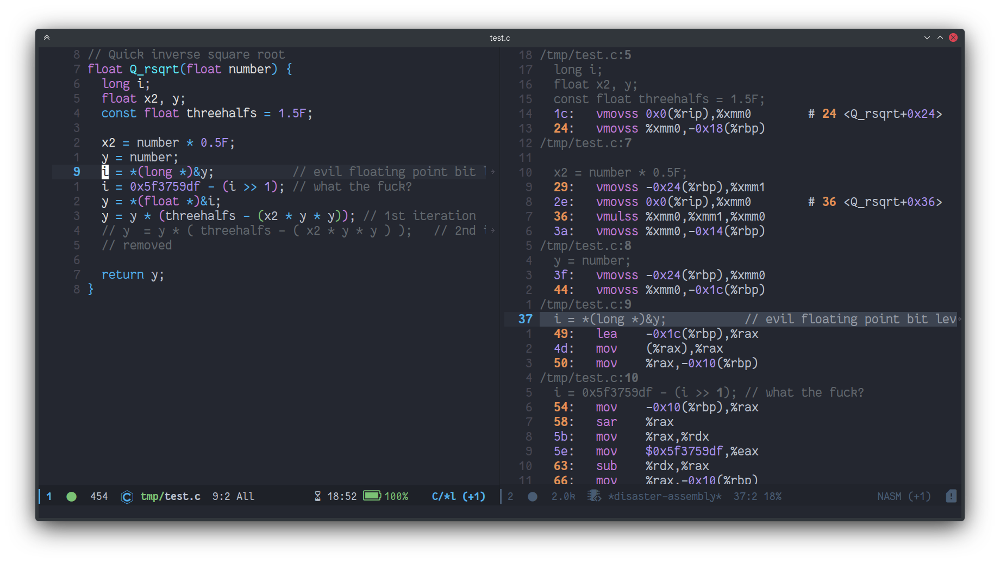

<a href="https://github.com/jart/disaster"></a>
## disaster.el
*Disassemble C, C++ or Fortran code under cursor*

---
[](http://www.gnu.org/licenses/gpl-2.0.html)
[](http://melpa.org/#/disaster)
[](http://stable.melpa.org/#/disaster)




Disaster lets you press `C-c d` to see the compiled assembly code for the
C, C++ or Fortran file you're currently editing. It even jumps to and
highlights the line of assembly corresponding to the line beneath your cursor.

It works in the following manner:

- If there is a `Makefile`, creating a `.o` file using `make`
- If there is a `compile_commands.json` file, use it to get the compilation
  command for the file.
- If none of the above files is presnet, use the default system compiler.

After compiling the source to a `.o` file, `disaster` runs that file through
`objdump` to generate the human-readable assembly.

### Installation


Make sure to place `disaster.el` somewhere in the `load-path`, then you should
be able to run `M-x disaster`. If you want, you add the following lines to
your `.emacs` file to register the `C-c d` shortcut for invoking `disaster`:

```elisp
(add-to-list 'load-path "/PATH/TO/DISASTER")
(require 'disaster)
(define-key c-mode-map (kbd "C-c d") 'disaster)
(define-key fortran-mode-map (kbd "C-c d") 'disaster)
```

#### Doom Emacs

For Doom Emacs users, you can add this snippet to your `packages.el`.

```elisp
(package! disaster
  :recipe (:host github :repo "jart/disaster"))
```

And this to your `config.el`:

```elisp
(use-package! disaster
  :commands (disaster)
  :init
  ;; If you prefer viewing assembly code in `nasm-mode` instead of `asm-mode`
  (setq disaster-assembly-mode #'nasm-mode)

  (map! :localleader
        :map (c++-mode-map c-mode-map fortran-mode-map)
        :desc "Disaster" "d" #'disaster))
```


### Customization Documentation

#### `disaster-make-flags`

Command line options to pass to make if a Makefile is found.

#### `disaster-assembly-mode`

Which mode to use to view assembly code.

#### `disaster-cc`

The command for your C compiler.

#### `disaster-cxx`

The command for your C++ compiler.

#### `disaster-fortran`

The command for your Fortran compiler.

#### `disaster-cflags`

Command line options to use when compiling C.

#### `disaster-cxxflags`

Command line options to use when compiling C++.

#### `disaster-fortranflags`

Command line options to use when compiling Fortran.

#### `disaster-objdump`

The command name and flags for running objdump.

#### `disaster-buffer-compiler`

Buffer name to use for assembler output.

#### `disaster-buffer-assembly`

Buffer name to use for objdump assembly output.

#### `disaster-project-root-files`

List of lists of files that may indicate software project root directory.
Sublist are ordered from highest to lowest precedence.

#### `disaster-c-regexp`

Regexp for C source files.

#### `disaster-cpp-regexp`

Regexp for C++ source files.

#### `disaster-fortran-regexp`

Regexp for Fortran source files.

### Function and Macro Documentation

#### `(disaster-create-compile-command-make MAKE-ROOT CWD REL-OBJ OBJ-FILEPROJ-ROOT REL-FILE FILE)`

Create compile command for a Make-based project.
MAKE-ROOT: path to build root,
CWD: path to current source file,
REL-OBJ: path to object file (relative to project root),
OBJ-FILE: full path to object file (build root!)
PROJ-ROOT: path to project root, REL-FILE FILE.

#### `(disaster-create-compile-command-compile-db MAKE-ROOT CWD REL-OBJOBJ-FILE PROJ-ROOT REL-FILE)`

Create compile command from a "compile_commands.json" file.
MAKE-ROOT: path to build root,
CWD: path to current source file,
REL-OBJ: path to object file (relative to project root),
OBJ-FILE: full path to object file (build root!)
PROJ-ROOT: path to project root, REL-FILE FILE.

#### `(disaster-get-object-file-path-compile-db COMPILE-CMD)`

Get the .o object file name from a full COMPILE-CMD.

#### `(disaster-create-compile-command USE-COMPILE-DB MAKE-ROOT CWD REL-OBJOBJ-FILE PROJ-ROOT REL-FILE FILE)`

Create the actual compile command.
- USE-COMPILE-DB: non NIL to use the compiler found in compile_commands.json,
generated by CMake or Bear for example, NIL to use Make or default compiler
options,
- MAKE-ROOT: path to build root,
- CWD: path to current source file,
- REL-OBJ: path to object file (relative to project root),
- OBJ-FILE: full path to object file (build root!)
- PROJ-ROOT: path to project root, REL-FILE FILE.

#### `(disaster &optional FILE LINE)`

Show assembly code for current line of C/C++ file.
Here's the logic path it follows:
- Is there a complile_commands.json in this directory? Get the object file
  name for the current file, and run it associated command.
- Is there a Makefile in this directory? Run `make bufname.o`.
- Or is there a Makefile in a parent directory? Run `make -C .. bufname.o`.
- Or is this a C file? Run `cc -g -c -o bufname.o bufname.c`
- Or is this a C++ file? Run `c++ -g -c -o bufname.o bufname.c`
- If build failed, display errors in compile-mode.
- Run objdump inside a new window while maintaining focus.
- Jump to line matching current line.
If FILE and LINE are not specified, the current editing location
is used.

#### `(disaster-find-project-root &optional LOOKS FILE)`

General-purpose Heuristic to detect bottom directory of project.
First, this will try to use `(vc-root-dir)` to guess the project
root directory, and falls back to manual check wich works by scanning
parent directories of FILE (using `disaster--find-parent-dirs`) for certain
types of files like a `.projectile` file or a `Makefile` (which is less
preferred).
The canonical structure of LOOKS is a list of lists of files
to look for in each parent directory where sublists are ordered
from highest precedence to lowest.  However you may specify
LOOKS as a single string or a list of strings for your
convenience. If LOOKS is not specified, it'll default to
`disaster-project-root-files`.

#### `(disaster-find-build-root USE-COMPILE-DB PROJECT-ROOT)`

Find the root of build directory.
USE-COMPILE-DB: non nil to use compile_commands.json,
PROJECT-ROOT: root directory of the project.

-----
<div style="padding-top:15px;color: #d0d0d0;">
Markdown README file generated by
<a href="https://github.com/mgalgs/make-readme-markdown">make-readme-markdown.el</a>
</div>
