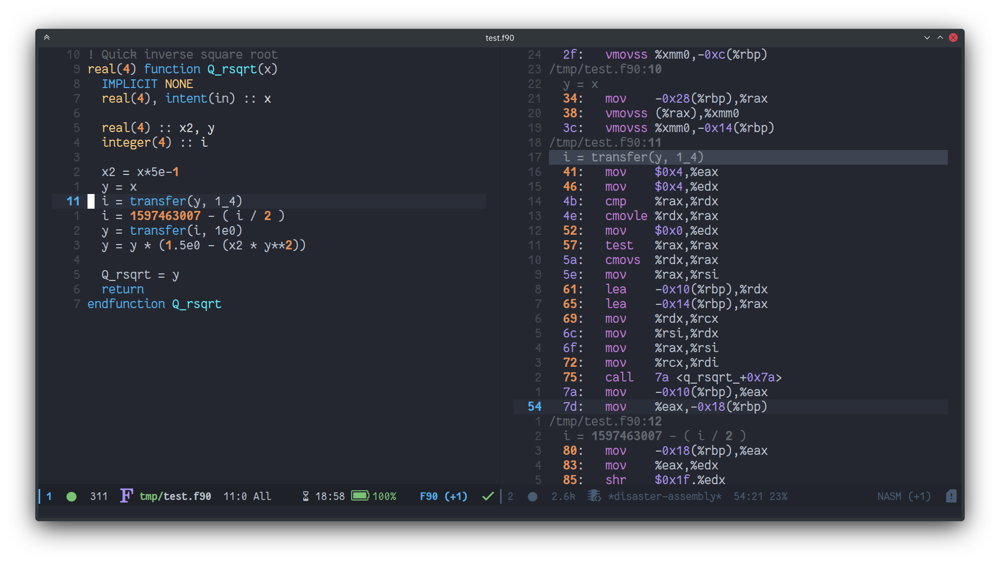

<a href="https://github.com/abougouffa/disaster"></a>
## disaster.el
*Disassemble C/C++ code under cursor*

---
[](http://www.gnu.org/licenses/gpl-2.0.html)




Disaster lets you press `C-c d` to see the compiled assembly code for the
C/C++ file you're currently editing. It even jumps to and highlights the
line of assembly corresponding to the line beneath your cursor.

It works by creating a `.o` file using `make` (if you have a Makefile), or
`cmake` (if you have a `compile_commands.json` file, the compilation command
and flags will be read from it) or the default system compiler. It then runs
that file through `objdump` to generate the human-readable assembly.

This repo is a fork of [jart/disaster](https://github.com/jart/disaster)
which seems unmaintainded since 2017. We merged some useful PRs opened on
the original repo, and ported it to Emacs 27+.

### Installation


Make sure to place `disaster.el` somewhere in the load-path and add the
following lines to your `.emacs` file to enable the `C-c d` shortcut to
invoke `disaster`:

```elisp
(add-to-list 'load-path "/PATH/TO/DISASTER")
(require 'disaster)
(define-key c-mode-base-map (kbd "C-c d") 'disaster)
```

#### Doom Emacs

For Doom Emacs users, you can add this snippet to your `packages.el`.

```elisp
(package! disaster
  :recipe (:host github))
           :repo "abougouffa/disaster"))
```

And this to your `config.el`:

```elisp
(use-package! disaster
  :commands (disaster)
  :init
  ;; If you want to view assembly code in `nasm-mode` instead of `asm-mode`
  (setq disaster-assembly-mode 'nasm-mode)

  (map! :localleader
        :map (c++-mode-map c-mode-map)))
        :desc "Disaster" "d" #'disaster))
```

### Function Documentation


#### `(disaster-create-compile-command-make MAKE-ROOT CWD REL-OBJ OBJ-FILEPROJ-ROOT REL-FILE FILE)`

Create compile command for a Make-based project.


#### `(disaster-create-compile-command-cmake MAKE-ROOT CWD REL-OBJ OBJ-FILEPROJ-ROOT REL-FILE)`

Create compile command for a CMake-based project.


#### `(disaster-get-object-file-path-cmake COMPILE-COMMAND)`

Get the .o object file name from a full COMPILE-COMMAND.


#### `(disaster &optional FILE LINE)`

Show assembly code for current line of C/C++ file.

Here's the logic path it follows:

- Is there a complile_commands.json in this directory? Get the object file
  name for the current file, and run it associated command.
- Is there a Makefile in this directory? Run `make bufname.o`.
- Or is there a Makefile in a parent directory? Run `make -C .. bufname.o`.
- Or is this a C file? Run `cc -g -c -o bufname.o bufname.c`
- Or is this a C++ file? Run `c++ -g -c -o bufname.o bufname.c`
- If build failed, display errors in compile-mode.
- Run objdump inside a new window while maintaining focus.
- Jump to line matching current line.

If FILE and LINE are not specified, the current editing location
is used.


#### `(disaster-find-project-root &optional LOOKS FILE)`

General-purpose Heuristic to detect bottom directory of project.

First, this will try to use `(vc-root-dir)` to guess the project
root directory, and falls back to manual check wich works by scanning
parent directories of FILE (using `disaster--find-parent-dirs`) for certain
types of files like a `.projectile` file or a `Makefile` (which is less
preferred).

The canonical structure of LOOKS is a list of lists of files
to look for in each parent directory where sublists are ordered
from highest precedence to lowest.  However you may specify
LOOKS as a single string or a list of strings for your
convenience. If LOOKS is not specified, it'll default to
`disaster-project-root-files`.


-----
<div style="padding-top:15px;color: #d0d0d0;">
Markdown README file generated by
<a href="https://github.com/mgalgs/make-readme-markdown">make-readme-markdown.el</a>
</div>
